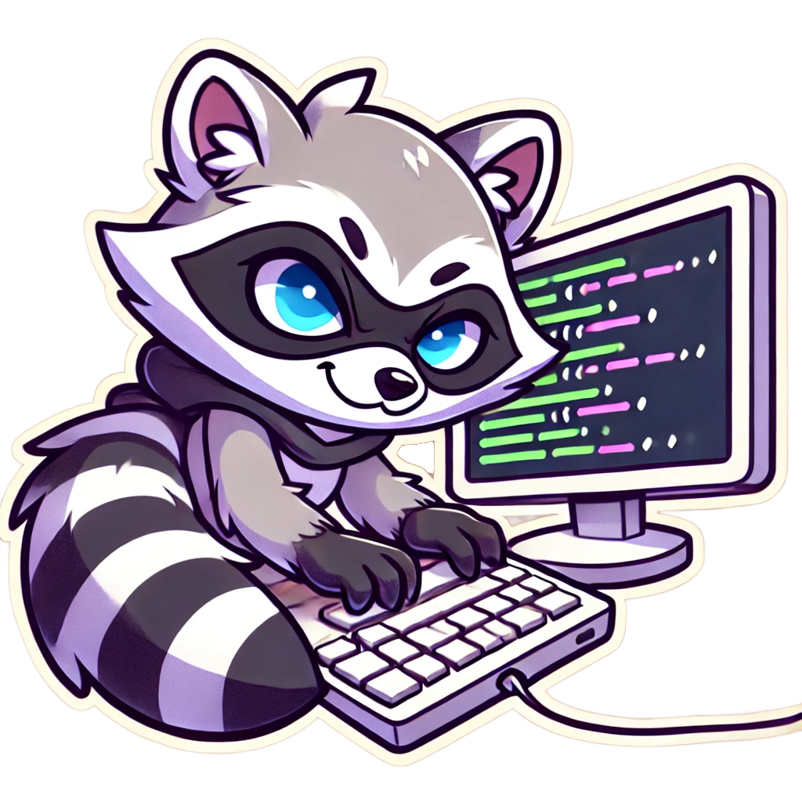
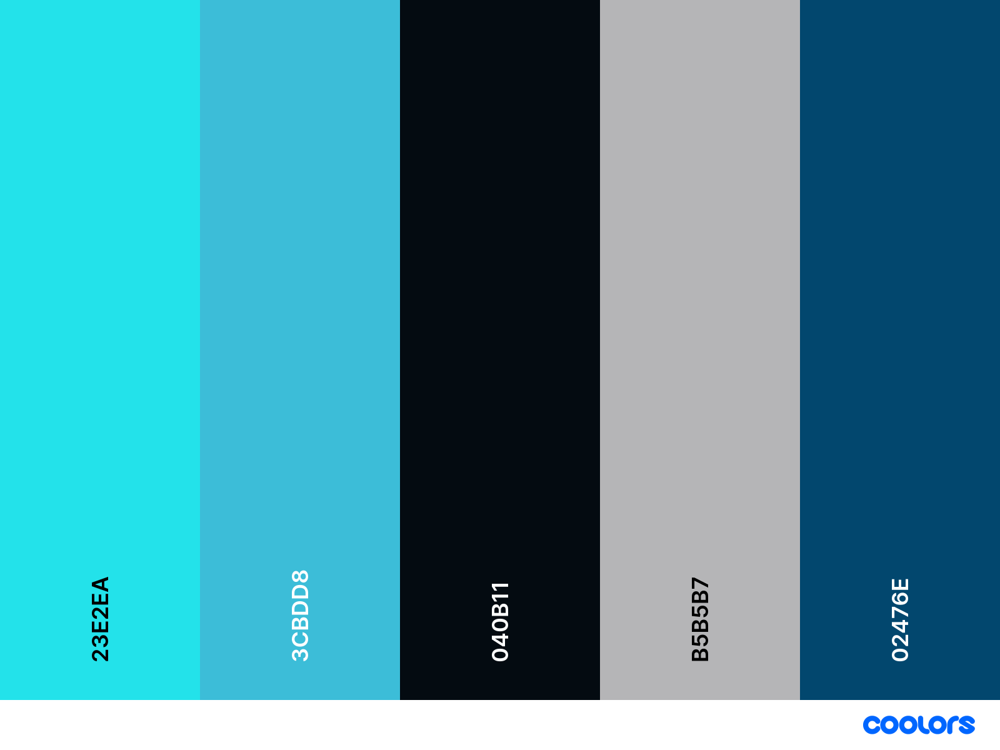
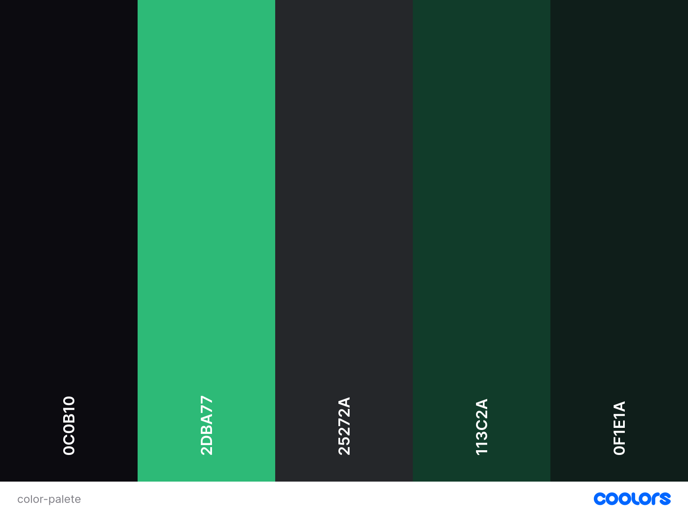
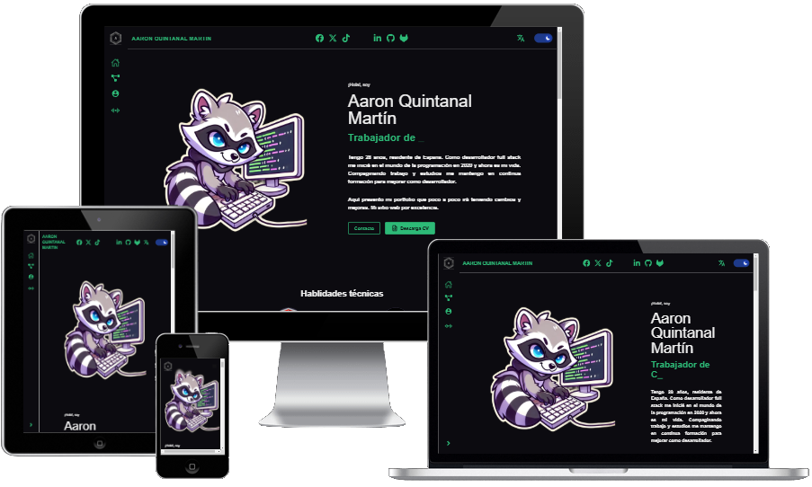

# 💻 Aarón Q. Martín - Portafolio de Programador 💻

Bienvenido a la versión 2.0.0 de mi portafolio personal.  
Este proyecto tiene como objetivo reflejar mi experiencia, habilidades y proyectos en el ámbito de la programación, presentado a través de una interfaz moderna, eficiente y responsiva.


---

## ✨ Características principales

* **Diseño adaptable**: Optimizado para una experiencia perfecta en dispositivos móviles, tabletas y escritorio.
* **Organización clara**: Secciones dedicadas a proyectos destacados, certificaciones y trayectoria profesional.
* **Rendimiento optimizado**: Construido con tecnologías modernas para asegurar tiempos de carga rápidos.
* **Enfoque minimalista**: Sin base de datos, 100% estático para un mantenimiento sencillo.
* **Preparado para el futuro**: Modular y listo para incorporar nuevas funcionalidades según sea necesario.

---

## 🚀 Requisitos del sistema

Antes de empezar, asegúrate de tener instalado:

- **Node.js**: `v20.18.1`
- **npm**: `v10.2.3`
- **Next.js**: `v15.0.3`
- **React**: `v18.3.1`

---

## 📥 Instalación

1. **Clonar el repositorio**

```bash
git clone https://github.com/AQM19/portfolio-aaron-quintanal-martin.git
cd portfolio-aaron-quintanal-martin
```

2. **Instalar dependencias**
```bash
npm install
```

3. **Ejecutar el servidor de desarrollo**
```bash
npm run dev

```
El sitio estará disponible en [localhost:3000](http://localhost:3000).

---

## 📤 Despliegue

### Despliegue en Vercel
Este proyecto está optimizado para ser desplegado en Vercel.
Pasos para desplegar:

Inicia sesión en tu cuenta de Vercel.
Conecta el repositorio desde el panel de control de Vercel.
Configura las variables de entorno necesarias en el panel de Vercel.
Realiza el despliegue directamente desde la plataforma.

## 🎨 Paleta de colores

### Tema claro


### Tema oscuro



## 📷 Capturas de pantalla
<!--  -->
---

## 🛠️ Tecnologías utilizadas

- **Next.js**: Framework para React con optimización de servidor y cliente.
- **React**: Biblioteca para crear interfaces de usuario interactivas.
- **TailwindCSS**: (Si lo usas) Para estilizar la web de forma eficiente y responsiva.
- **i18next**: (Si lo usas) Gestión de traducciones para soporte multilenguaje.

---

## 🌟 Mis proyectos destacados
El portafolio incluye proyectos de programación con un enfoque en inteligencia artificial, desarrollo web y optimización de interfaces. Cada proyecto está documentado con enlaces al código fuente y ejemplos funcionales.

## 🌍 Multilenguaje
El sitio está preparado para soporte multilenguaje.